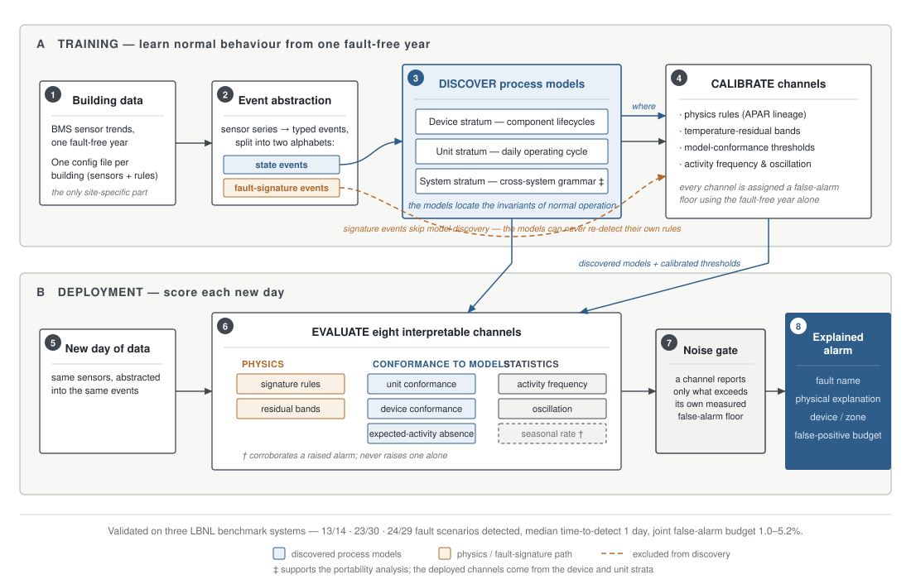

# STRATA — fault detection for buildings that explains itself

**An event log written from sensor data by configuration alone; calibrated,
interpretable channels that detect faults on it under a stated false-alarm
budget — so every alarm ships with a device name and a physical reason. The
discovered process models describe healthy operation; five systems and two
transfer tests show they neither detect nor predict, and that null is
reported as a result.**


---

## The 60-second version

Buildings waste 5–30% of their energy on equipment faults nobody notices: a
valve stuck half-open, a damper that never closes, a sensor that quietly reads
2 °C wrong. The systems that are supposed to catch these have a **trust
problem**:

- **Rule libraries** (the industry standard) fire so many unexplained alarms
  that operators learn to ignore them.
- **Machine-learning detectors** can flag that *something* is off — but can't
  say *what*, *where*, or how often they cry wolf.

STRATA takes a third path. It **learns what "normal" looks like** for a
specific building from one fault-free year of its own data — the way a doctor
learns a patient's baseline before diagnosing anything — and then it watches
for days that break that normal. The difference from ML: what it learns is
*readable* (models of how equipment actually behaves, plus physical rules),
and every alarm it raises comes with three things a black box can never give
you:

> **a name** ("reheat valve, zone S") · **an explanation** ("commanded closed,
> position 0.8 for 3.2 hours") · **a false-positive budget** ("this detector
> is wrong on ~1% of fault-free days — measured, not hoped")

Tested on five public benchmark systems (LBNL datasets), it detects
**13 of 14, 23 of 30, 24 of 29 — 45 of 55 on a dual-duct AHU and 42 of 47 on a fan coil unit, both onboarded
blind, by configuration alone, after the protocol was fixed** — typically
within **one day**, while false-alarming on only **1.0–5.2%** of fault-free days —
and on the first *measured* building (an LBNL field rooftop unit, 182 clean days,
no schedule point) the same deployed detector false-alarms on **6.1%** of
held-out days ([PHASE11_RESULTS.md](PHASE11_RESULTS.md), X26).
And when this project's own audit process discovered that one of its
"detections" was an artifact of a dataset defect, we **removed it from our own
scorecard and published why** — that discipline is as much the contribution
as the numbers.

---

## The framework in one figure

<p align="center">
  
</p>

**How to read it:** blue is what the system *discovers* (models of normal
behaviour at three levels); amber is the *physics* path (classical
engineering rules). The two are deliberately walled apart during training —
that wall is one of the paper's key results (see stage 2 below). Nothing
reaches the operator without passing a noise gate.

---

## How it works — the eight stages

**① Building data.** One fault-free ("baseline") year of ordinary building
management system trends — temperatures, valve and damper positions, fan
status. Plus **one configuration file** naming the building's sensors and
rules. That file is the *only* thing site-specific: we onboarded a second
building type in ~1.5 hours and a third in minutes, with **zero code
changes** ([evidence](configs/ONBOARDING_LOG.md)).

**② Event abstraction.** Raw sensor curves become discrete events
("cooling started", "valve commanded closed but still open"). Crucially, the
events are split into two alphabets:
- **state events** — neutral facts about operation, safe to learn from;
- **fault-signature events** — things that already smell like faults.

**Why the split matters:** if the fault-smelling events were allowed into
model training, the models would "detect" faults simply by recognising our
own rules — circular reasoning dressed up as machine learning. We didn't just
argue this; we **measured** it: without the wall, 5.2% of the model channel's
apparent skill; with it, 1.8% — meaning **3.4 percentage points of what
looked like intelligence was the model echoing our own rules**
([Phase 1](PHASE1_RESULTS.md)). Most of the literature warns about this trap
abstractly; we quantified our own.

**③ Discover.** Process-mining algorithms build models of normal operation
at three levels (*strata* — hence the name): each **device's** lifecycle
(a valve's open/close rhythm), the **unit's** daily operating cycle
(morning start → economizer window → evening stop), and — for analysis of
how the method transfers across buildings — a **cross-system grammar**. The
models' real job is to reveal *where* behaviour is invariant: *"this
building heats every single morning"*, *"this fan cycles 9 times a day,
every day."*

**④ Calibrate.** Knowing where the invariants are, eight detection channels
are calibrated to hold them: physics rules (descended from NIST's APAR rule
set), temperature-residual bands (e.g., with the cooling coil off, supply
air minus mixed air should equal fan heat — a biased sensor shows up here
verbatim), conformance-to-model thresholds, and statistical bands on
activity frequency and oscillation. Every channel gets a **false-alarm
floor** established from the fault-free year alone — no fault data, no
hand-tuned thresholds.

**⑤–⑥ Score each new day.** All eight channels evaluate the day
independently. Each speaks its own language: the rules channel names
physical contradictions; conformance says "this device stopped behaving like
its model"; frequency says "the cooling cycled 40 times today, normal is
4–9."

**⑦ The noise gate.** The heart of the trust story: **a channel may only
report what exceeds its own measured noise floor.** Three suspicious days out
of 365 is statistically indistinguishable from noise — so it stays silent.
This single discipline is why the false-alarm budget is a number we can
print rather than a hope.

**⑧ The explained alarm.** What survives the gates reaches the operator with
the name, the explanation, the implicated device/zone, and the budget.

---

## Results

Validated on five [LBNL fault-detection benchmark datasets](https://data.openei.org/submissions/5763)
(a single-duct air-handling unit, two fan-powered-unit types — the FPU
datasets had never been benchmarked by anyone — and, added last and onboarded
blind by a pre-registered configuration-only protocol, a dual-duct AHU and a
fan coil unit):

| | SDAHU | PFPU | SFPU | DDAHU (X17) | FCU (X19) |
|---|---|---|---|---|---|
| fault scenarios detected | **13 / 14** * | **23 / 30** | **24 / 29** | **45 / 55** | **42 / 47** |
| median time-to-detect (all significant channels, rate included) | 1 day | 1 day | 1 day | 1 day | 1 day |
| time-to-detect tail (longest first alarm among detected scenarios) | 2 days | 21 days | 108 days | 114 days | 15 days |
| false-alarm budget, deployed detector (fault-free holdout days) | 1.0% | 5.2% | 4.2% | 3.1% | 4.2% |
| false-alarm rate, naive union of all eight channels (compare against this if your method has no budget) | 15.6% | 12.5% | 4.2% | 8.3% | 21.9% |

DDAHU: 79 sensor mappings, 41 rules, one healthy-silence iteration, no source
change, gate battery clean (including a configuration-branch comparison); every family caught in full except coil fouling
(5/12) and static-pressure sensor bias (5/8); nothing detected by the
process-mining channels alone ([PHASE10_RESULTS.md](PHASE10_RESULTS.md)).

FCU: 29 sensor mappings, 23 rules, two healthy-silence iterations, no source
change; the hash gate found a byte-identical pair under two family labels
(scored once, [ERRATA.md](ERRATA.md) E6); both new scorecard families — airflow
restriction and reverse/unstable control, four at the documentation's granularity — caught in full; misses are five of
six waterside-fouling files (the cooling coil's leave the recorded points
within about 3% of healthy); the 20% damper leak was caught once an
outdoor-air-fraction residual was added (X24, [PHASE11_RESULTS.md](PHASE11_RESULTS.md)). Its first run fired two falsifiers (28/96 false alarms; six
"detections" by the model channel alone) that traced to a scoring-script
assumption — any non-zero mode is scheduled operation — which this unit's
idle setback weekends broke; the repair was pre-registered, the four earlier
scorecards regenerated byte-identically, and run 2 is the row above.

\* **The asterisk is the honest part.** The detector originally scored 14/14.
Our own audit then discovered the dataset's "healthy" file was simulated
under a *different configuration* than every fault file (documented as
[erratum E5](ERRATA.md)) — and exactly one "detection" turned out to be the
detector noticing that difference, not the fault. We adjudicated it away and
report both numbers. **The protocol caught our own detector. That is the
point of the protocol.**

**Against a strong ML baseline** (PCA-SPE, honestly tuned): a near-tie on raw
detection count (60 vs 61 across all systems, with complementary misses) —
but the baseline cannot name a valve, explain a flag, or state its alarm
budget. Equal counting power; only one side is accountable.

**Not a result:** `outputs/openfdd_baseline_*.json` are marked `"verdict": "VOID"` in-file — a first attempt at the Guideline 36 comparison that failed its own audit; see the repair plan they point to. Quote nothing from them.

Every number above regenerates from this repository —
see [REPRODUCING.md](REPRODUCING.md) for the clone-to-artifacts runbook.

---

## The journey — eight phases, and what broke in each

This project's rule: every phase gets attacked by an adversarial audit
before its results count, and **every pre-registered falsifier that fires
gets published, not buried.** The breakages are the most instructive part.

| Phase | What it built | What broke — and what it taught |
|---|---|---|
| [1](PHASE1_RESULTS.md) | The state/signature alphabet split | The model had been re-detecting our own rules — **3.4 pp of fake skill, measured** |
| [2](PHASE2_RESULTS.md) | Physics-residual channels (sensor-bias detection 0% → ~40% of days) | Our first threshold was set while able to see the answers — rebuilt blind, train-only |
| [3](PHASE3B_RESULTS.md) | Two new buildings onboarded config-only; device-level models | A one-line hand-written rule out-covered our model — **falsifier fired**; claim honestly reframed: *models find where invariants live; rules exist only after models point there* |
| [4](PHASE4_RESULTS.md) | Frequency & oscillation channels; ML baselines; statistics battery | Our own PCA baseline was "detecting" **file provenance, not faults** (a per-branch constant on two static-pressure columns — [erratum E3](ERRATA.md); the earlier "swapped units" reading is retracted there); an invalid significance test retracted 13 phantom stars |
| [5](PHASE5_RESULTS.md) | Cross-system grammar; the reversal probe (a novel one-number test of whether a model encodes order) | The zero-shot-transfer hypothesis **failed its own pre-registered test** — portability is config-only, and we say so |
| [6](PHASE6_RESULTS.md) | The joint false-alarm budget & single detector definition | The naive 8-channel union false-alarmed on **15.6%** of clean days — one channel caused nearly all of it and was demoted to advisory-only (verified zero cost) |
| [7](PHASE7_RESULTS.md) | Made the record citable: [five dataset errata](ERRATA.md) with machine evidence, full reproducibility | Recomputing our own strongest evidence sentence **falsified it** — and uncovered erratum E5 in the process |
| [8](PHASE8_RESULTS.md) | The adjudication & robustness suite | **14/14 → 13/14** (see asterisk above); training contamination breaks the calibration at **one silent bad day** (measured, with the mitigation measured too); configs don't transfer across sampling rates (three falsifiers fired, honored) |

The complete lesson ledger — 31 numbered lessons, each with the standing
rule it produced — is in [RESEARCH_LOG.md](RESEARCH_LOG.md).

### Side contribution: the datasets themselves

Along the way we documented **six defects in the most widely used public
FDD benchmark datasets** — duplicate fault files shipped under different
severity labels, a mislabeled fault run, unit-swapped columns that let any
ML model cheat, a date-rotated file, a fan-coil-unit run shipped under two
family labels, and the configuration-branch mismatch
behind our asterisk. Each ships with machine-verifiable evidence and a
recompute command: **[ERRATA.md](ERRATA.md)**. Anyone benchmarking on these
datasets inherits these issues silently; now there's a citable record.

---

## Why you can trust the numbers

- **Pre-registration.** Hypotheses *and* the conditions that would kill them
  are committed to git before the experiment runs.
- **Falsifiers are honored.** Multiple fired across the project — including
  against our favourite results — and every firing is in the record.
- **Hostile audits.** Every phase was adversarially attacked (recomputation
  from raw data included) before its numbers were accepted.
- **Reproducibility.** `git clone` → [REPRODUCING.md](REPRODUCING.md) →
  every table regenerates. More than a hundred automated tests pin the published numbers and
  the fired falsifiers, so a change that would alter either fails the build.
- **The plan is public.** [MASTER_PLAN.md](MASTER_PLAN.md) tracks every gap
  ever found and its status — including the open ones.

---

## Using it

The research pipeline is being packaged as a Python toolkit. The core API
already works (note: the `strata run` command is the original single-model
conformance demo, whose detector this project refuted — it prints a warning
saying so; the deployed detector is the `fit()`/`evaluate()` API below):

```python
from strata.io.config import load_config
from strata.core.pipeline import fit

cfg = load_config("configs/lbnl_sdahu")   # one YAML per building
det = fit(cfg, healthy_year_dataframe)     # discover + calibrate everything
report = det.evaluate(new_data)            # per-channel flags, noise gates,
                                           # explained verdict
```

- License: **MIT** ([one dependency note](LICENSING-NOTES.md) about the
  process-mining library)
- Cite: [CITATION.cff](CITATION.cff)
- Toolkit status: facade + significance gates done; CLI and config
  validation in progress ([roadmap](MASTER_PLAN.md))

## Repository map

| | |
|---|---|
| `src/strata/` | the library (event abstraction, discovery, channels, gates, facade) |
| `configs/lbnl_*/` | per-building configuration — the entire onboarding cost |
| `scripts/` | the evaluation harness that produced every number here |
| `outputs/` | committed result artifacts (every quoted number lives in one) |
| `PHASE1–8_RESULTS.md` | the phase-by-phase record |
| `RESEARCH_LOG.md` | discoveries, lessons L1 onward (thirty-two at the time of writing), the canonical numbers |
| `ERRATA.md` / `REPRODUCING.md` | dataset defects / how to regenerate everything |
| `paper/` | the manuscript in progress (ICPM 2027) |

---

*Data: [LBNL Fault Detection and Diagnostics Datasets](https://data.openei.org/submissions/5763)
(Granderson et al., CC BY 4.0 — thank you). Research conducted at Thompson
Rivers University (UREAP); mentors: A. Aighobahi and M. Sharma.*
